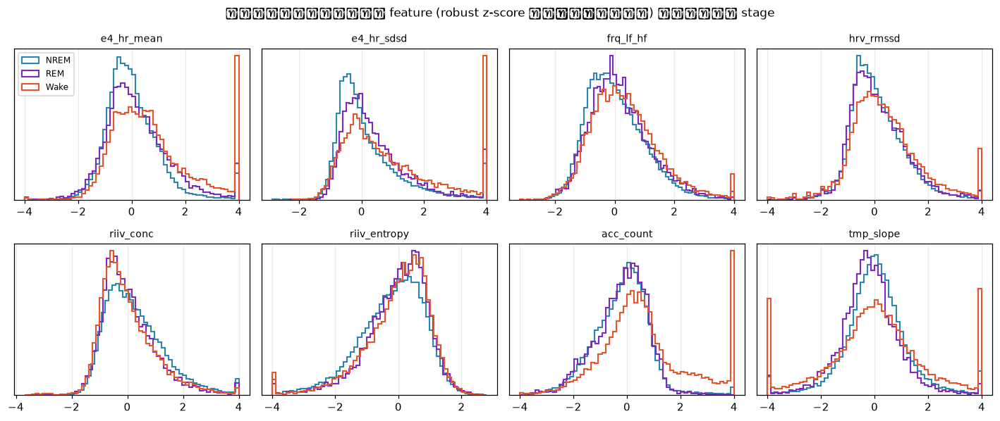
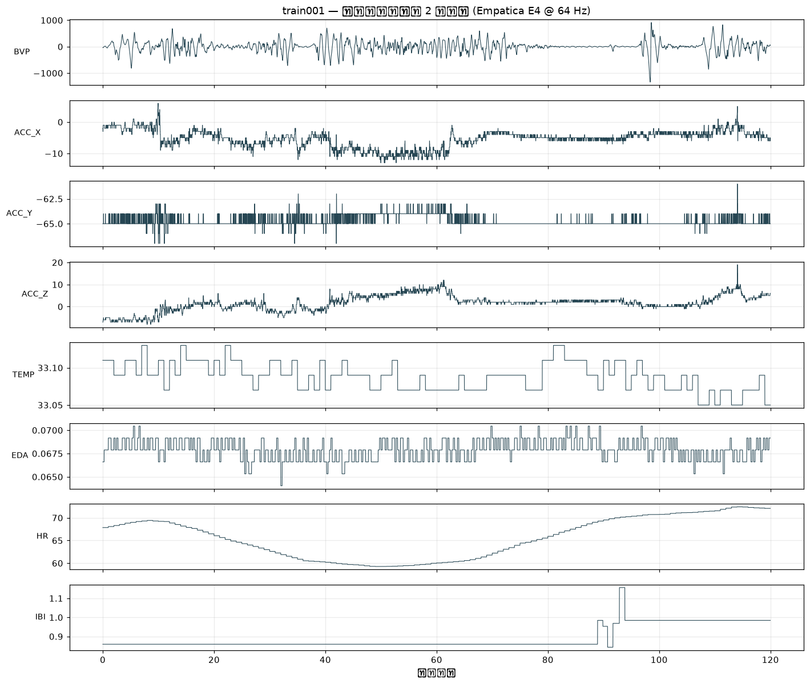
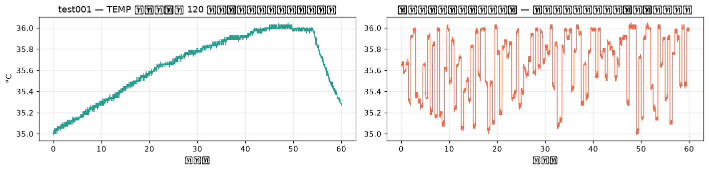
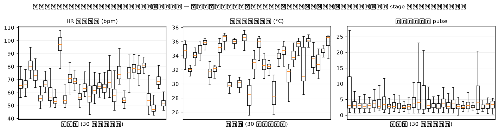
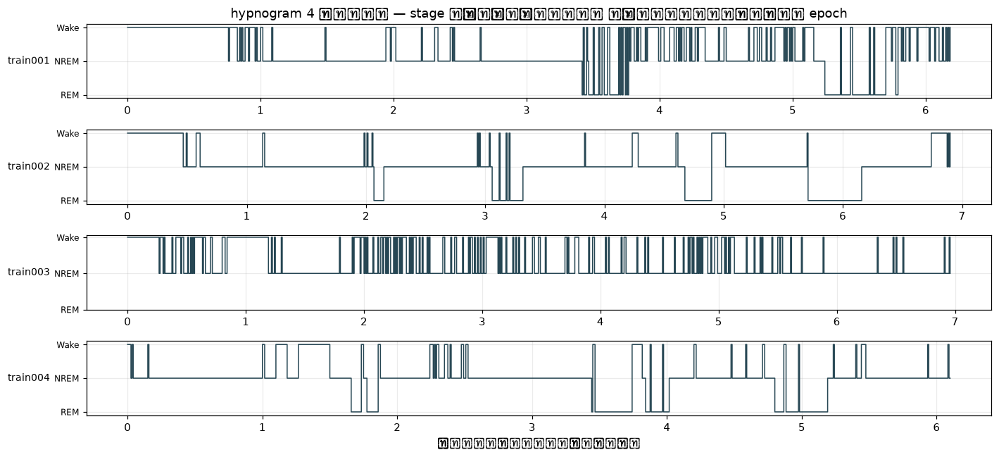

# 😴 Sleep Stages Classification

<p>
 <b>SuperAI Season 4 | Individual Hackathon 5</b> &nbsp;·&nbsp; <i>Python-first rebuild (2026)</i>
</p>

<p>
 ใน Hackathon นี้เราต้องบอกว่าคนที่ใส่ <b>สายรัดข้อมือ</b> อยู่ ตอนนี้กำลัง <b>ตื่น (W)</b> · <b>หลับธรรมดา (N = NREM)</b> หรือ <b>หลับฝัน (R = REM)</b> โดยดูจากสัญญาณชีวภาพทีละ 30 วินาที<br>
 รอบเดิมทำแบบ FFT + AutoGluon ได้ <b>0.58881 public / 0.59865 private</b> (อันดับ 28 จาก 156 ทีม, ที่ 1 ของตารางอยู่ที่ 0.59331)<br>
 รอบนี้เขียนใหม่เป็น <b>Python package</b> — ประเด็นชี้ขาดไม่ใช่โมเดล แต่คือการค้นพบว่า <b>ไฟล์ test เรียงตามเวลาและต่อกันได้ทั้งคืน</b> จึงใช้ context ทั้งคืนแทนการตัดสินทีละ epoch โดด ๆ
</p>

> **Task** : Sleep Staging 3 คลาส (W / N / R) จาก wearable, cross-subject &nbsp;|&nbsp; **Metric** : macro F1 &nbsp;|&nbsp; **Tools** : scipy · LightGBM · PyTorch (BiLSTM/TCN) · Viterbi

<hr>

## 🔁 รอบนี้ต่างจากเดิมยังไง

| | รอบเดิม | รอบนี้ |
|---|---|---|
| รูปแบบโค้ด | Notebook เดียว (ซอย 30 วิ → FFT → AutoGluon) | **Python package** (`src/sleep_stage/`) + CLI · notebook ไว้ทำ EDA เท่านั้น |
| มุมมองต่อ 1 epoch | ตัดสินโดด ๆ ไม่รู้ว่า epoch ข้าง ๆ เป็นอะไร | **ต่อ test กลับเป็นคืนเดียว** → BiLSTM/TCN ทั้งคืน + Viterbi |
| Feature | mean/std/var + mean/std/var ของ |FFT| ต่อช่อง (48 ตัว) | HRV · **การหายใจ (RIIV/RSA)** · actigraphy · EDA · อุณหภูมิ (96 ตัว) แล้วขยายด้วย context |
| ความต่างระหว่างคน | ไม่ได้จัดการ | **robust z-score ต่อคืน** (test คือคนที่ไม่เคยเห็น) |
| Validation | ไม่ได้แยกตามคน | **GroupKFold ทั้งคืน** — ไม่เคยแยกคนเดียวกันข้าม fold |
| กฎการตัดสิน | argmax | **จูน bias ต่อคลาสบน OOF ให้ macro F1 สูงสุด** ผ่าน decoder ตัวเดียวกับตอน predict |
| Reproduce | ต้องมีข้อมูลอยู่แล้ว | `make setup && make data && make cache && make train` |

<hr>

## 📚 Research ก่อนลงมือ

<p>
 <b>1. ข้อมูลคือ DREAMT ไม่ใช่ EEG</b> — 8 คอลัมน์ (BVP, ACC_X/Y/Z, TEMP, EDA, HR, IBI) ตรงกับสายรัดข้อมือ <b>Empatica E4</b> เป๊ะ
 และตรงกับชุด <a href="https://physionet.org/content/dreamt/">DREAMT</a> ของ PhysioNet (E4 + PSG ที่ sync กัน 100 คน) โฟลเดอร์ <code>data_64Hz</code> แล้วยุบ label เหลือ 3 คลาส
 → วิธีคิดทั้งหมดต้องเป็นแนว <b>cardio-respiratory + actigraphy</b> ไม่ใช่ band power ของสมอง
</p>

<p>
 <b>2. เพดานของ wearable รู้กันอยู่แล้วว่าต่ำ</b> — งาน decomposition ปี 2026 วัดเพดานไว้ชัด : HR+ACC แบบนาฬิกาทั่วไป κ≈0.255 ·
 non-EEG ในห้องแล็บ (ECG+Resp+SpO₂) κ≈0.492 · EEG+EOG κ≈0.796 และสรุปว่า <i>"ตัวจำกัดคือข้อมูลต่อ epoch ไม่ใช่ความซับซ้อนของโมเดล"</i>
 ส่วน Viterbi ช่วยได้ราว Δκ +0.04 — ซึ่งตรงกับที่เราวัดได้เองเป๊ะ ๆ
</p>

<p>
 <b>3. สิ่งที่ให้ผลมากที่สุดคือ "การหายใจ"</b> — benchmark ขนาดใหญ่บน SLEEP (2025) ชี้ว่าการเติมสัญญาณการหายใจเข้าไปกับ actigraphy+HRV
 ช่วย <b>W และ R</b> มากที่สุด และงาน non-contact REM/NREM ที่ใช้ความ "ไม่นิ่ง" ของการหายใจเป็น feature หลักได้ REM recall 0.735
 → เราจึงสกัดสัญญาณการหายใจจากข้อมือสองทาง : <b>RIIV</b> (การหายใจไปมอดูเลตความสูงของ pulse) และ <b>RSA</b> (การหายใจไปมอดูเลตช่วงห่างการเต้น)
 แล้ววัด "ความคมของยอดสเปกตรัม" — NREM หายใจเป็นจังหวะ ยอดคม · REM หายใจมั่ว ยอดเบลอ
</p>

<p>
 <b>4. Temporal context คือของฟรี</b> — SleepPPG-Net และงานตระกูล "Super Window" ป้อน PPG ทั้งคืนให้โมเดล seq2seq
 ส่วน SLAMSS ใช้แค่ mean HR / std HR / mean activity ต่อ 30 วินาที แต่เป็น LSTM ทั้งคืน ก็ได้ผลดี
 → โมเดลหลักของเราเป็น <b>BiLSTM/TCN ที่กิน feature ทั้งคืนแล้วคาย softmax ต่อ epoch</b>
</p>

<p>
 <b>5. PPG ที่ข้อมือ noise สูงกว่า ECG มาก</b> — การหา beat ตรง ๆ บน BVP ของ E4 ให้ HR เพี้ยนได้ถึง 8 bpm เมื่อเทียบกับ HR ที่เครื่องคำนวณเอง
 เราจึงใช้ <b>สเปกตรัม 30 วินาที</b> (nfft 8192 + parabolic interpolation) เป็นตัวกำกับว่า beat ที่เจอมีช่วงห่างที่เป็นไปได้แค่ไหน และเก็บ "ความคมของยอด" ไว้เป็นตัวบอกคุณภาพสัญญาณ
</p>

<p>
 <b>6. metric เป็น macro F1 ไม่ใช่ accuracy</b> — R มีแค่ ~11 % แต่ถูกนับเท่ากับ N ที่มี 65 %
 ทายคลาสเดียวทั้งหมดได้ macro-F1 ≈ 0.26 (ตรงกับ submission เดิมที่ทาย N ล้วนแล้วได้ 0.2666 พอดี — ใช้ยืนยันว่า metric คือ macro จริง)
 → argmax ของ posterior ไม่ใช่กฎที่ถูกสำหรับ macro F1 ต้องจูน bias ต่อคลาส
</p>

<hr>

## 🔎 EDA — สิ่งที่พบ (`notebooks/01_eda.ipynb`)

### ข้อมูล

| | |
|---|---|
| train | 83 คืน (คนละคน) · `train/train/trainNNN.csv` ทั้งคืนอยู่ในไฟล์เดียว มี `Sleep_Stage` |
| test | 10 คืน · ซอยเป็น epoch ละไฟล์ไว้แล้ว รวม 7,970 epoch |
| 1 epoch | 1,920 แถว = **30 วินาที @ 64 Hz** |
| ความยาวคืน | 711–955 epoch (median 807 ≈ 6.7 ชั่วโมง) |
| คลาส | **N 65.5 % · W 23.8 % · R 10.7 %** |

อัตราสุ่มจริงอ่านได้จาก "ค่าเปลี่ยนทุกกี่ sample" : BVP 64 Hz · ACC 32 Hz · EDA 4 Hz · HR 1 Hz ส่วน TEMP ถูกปัดเป็น 0.01 °C
และ **IBI เปลี่ยนค่านาน ๆ ครั้ง** เพราะ E4 รายงานเฉพาะ beat ที่มั่นใจ → จำนวนครั้งที่ IBI เปลี่ยนใน 1 epoch เลยกลายเป็น *feature บอกคุณภาพสัญญาณ* ไปในตัว



### ✅ ข้อค้นพบที่ชี้ขาด — test เรียงตามเวลาและต่อกันสนิท

`testNNN_00000 … 00854` ไม่ได้สลับมา แต่เรียงตามเวลาจริง พิสูจน์ด้วยสัญญาณที่เปลี่ยนช้า : ค่าสุดท้ายของไฟล์ *i* ต่อกับค่าแรกของไฟล์ *i+1* ได้แนบสนิท

| สัญญาณ | ช่องว่างเมื่อเรียงตามเลขไฟล์ | ช่องว่างเมื่อสุ่มลำดับ |
|---|---|---|
| TEMP | 0.0100 | 0.2700 |
| EDA | 0.0013 | 0.0218 |
| HR | 0.0300 | 1.3300 |



→ **ต่อ test กลับเป็นคืนเดียวได้** นี่คือสิ่งที่รอบเดิมทิ้งไปทั้งหมด และเป็นที่มาของคะแนนที่เพิ่มขึ้นเกือบทั้งหมดในรอบนี้

### คนต่างกันมากกว่า stage ต่างกัน

ค่ากลางของ HR ต่างกันได้ 45–90 bpm ระหว่างคน ขณะที่ระยะห่างระหว่าง NREM กับ REM ในคนเดียวกันอยู่แค่ไม่กี่ bpm
และ test คือคน 10 คนที่โมเดลไม่เคยเห็น → ทุก feature ถูก **robust z-score ด้วย median/IQR ของคืนตัวเอง** ก่อนเข้าโมเดล



### hypnogram มีโครงสร้างเวลาชัดเจน

| จาก \ ไป | N | R | W |
|---|---|---|---|
| **N** | 0.938 | 0.009 | 0.053 |
| **R** | 0.029 | 0.929 | 0.043 |
| **W** | 0.159 | 0.008 | 0.833 |

โอกาสอยู่ stage เดิมต่ออีก 30 วินาทีเกิน 0.83 ทุกคลาส และมีแค่ **8.8 %** ของ epoch ที่ stage เปลี่ยน
classifier ที่ตัดสินทีละ epoch จะ "กระพริบ" เพราะไม่มีอะไรห้าม → เอา transition matrix นี้ไปถอดรหัสทั้งคืนด้วย **Viterbi**



<hr>

## 🧱 Pipeline

```
datasets/train/train/*.csv ──┐
datasets/test/test_segment/ ─┴─► data.py      ต่อ test กลับเป็นคืนเดียว, cache ต่อคืน
                                    │
                                    ▼
                                features.py   96 feature ต่อ epoch 30 วินาที
                                    │           hrv_* HRV จาก beat ที่หาเอง (มีสเปกตรัมกำกับ)
                                    │           frq_* VLF/LF/HF บน context 5 นาที
                                    │           riiv_/rsa_* อัตราและความสม่ำเสมอของการหายใจ
                                    │           ppg_*  ความสูง pulse · คุณภาพสัญญาณ
                                    │           acc_*  การขยับ · ท่านอน · ความนิ่ง
                                    │           tmp_/eda_/e4_* อุณหภูมิ · EDA · HR ของเครื่อง
                                    ▼
                                context.py    robust z-score ต่อคืน + rolling/lag + ตำแหน่งในคืน
                                    │
                    ┌───────────────┴───────────────┐
                    ▼                               ▼
             models.py lgbm                  models.py bilstm / gru / tcn
         (context อยู่ในคอลัมน์)              (เห็นทั้งคืนเป็น sequence)
                    └───────────────┬───────────────┘
                                    ▼
                              calibrate.py    จูน bias ต่อคลาสบน OOF ให้ macro F1 สูงสุด
                                    ▼
                               smooth.py      Viterbi ด้วย transition matrix จาก train
                                    ▼
                              submission.csv
```

<hr>

## 📊 ผลลัพธ์

ทุกตัวเลข CV มาจาก **GroupKFold 5 fold ตามคืน** (คนเดียวกันไม่เคยอยู่สองฝั่ง) — เป็นการจำลองสถานการณ์จริงที่ test คือคน 10 คนที่ไม่เคยเห็น

### ทีละขั้นว่าอะไรให้คะแนนมาจากไหน

| ขั้น | OOF macro-F1 | N | R | W |
|---|---|---|---|---|
| LightGBM + feature ชุดแรก (ไม่มีการหายใจ), argmax | 0.5800 | 0.821 | 0.379 | 0.650 |
| &nbsp;&nbsp;+ Viterbi | 0.6167 | — | — | — |
| LightGBM + feature v2 (เติม RIIV/RSA), argmax | 0.5994 | 0.834 | 0.327 | 0.637 |
| &nbsp;&nbsp;+ Viterbi | 0.6276 | 0.823 | 0.416 | 0.644 |
| &nbsp;&nbsp;+ **จูน bias ต่อคลาสบน OOF** (bias N −0.53 · R +0.97 · W −0.43) | **0.6448** | — | — | — |

สามอย่างที่ให้ผลจริง เรียงตามขนาด
1. **Viterbi ทั้งคืน +0.028** — ทำได้เพราะ test เรียงตามเวลา ตรงกับที่งานวิจัยรายงานไว้ (Δκ ≈ +0.04)
2. **จูน bias ต่อคลาส +0.017** — metric เป็น macro F1 ไม่ใช่ accuracy argmax จึงไม่ใช่กฎที่ถูก
3. **feature การหายใจ +0.011** — และเห็นผลที่ **R โดยเฉพาะ** (0.379 → 0.416)

### Leaderboard

| | public | private |
|---|---|---|
| รอบเดิม — FFT + AutoGluon (อันดับ 28 จาก 156) | 0.58881 | 0.59865 |
| ที่ 1 ของตารางรอบแข่งจริง | 0.59331 | — |
| **รอบนี้ — LightGBM + Viterbi + calibration** | **0.66428** | **0.67136** |

> คะแนน leaderboard สูงกว่า CV เล็กน้อย (0.664 vs 0.645) เพราะ full fit ได้เห็นครบทั้ง 83 คืน ขณะที่โมเดลใน CV เห็นแค่ 80 %

<hr>

## 🚀 วิธีใช้

```bash
make setup                                  # uv sync
make data                                   # โหลดจาก Kaggle (ต้องมี ~/.kaggle/kaggle.json)
make cache                                  # สกัด feature ต่อคืน (~30 วินาที บน 14 core)
make train                                  # CV + full fit
make train SET='--set model.name=lgbm'      # เปลี่ยนโมเดล
make predict                                # เขียน submissions/submission.csv
uv run python scripts/ablate.py features    # ไล่ ablation เป็นชุด
uv run python scripts/ensemble.py --write   # ผสมหลาย run แล้วเขียน submission
```

<hr>

## 📁 ไฟล์ในโฟลเดอร์นี้

- [`HANDOVER.md`](./HANDOVER.md) — **สถานะงานและสิ่งที่ต้องทำต่อ** (งานยังไม่จบ — sweep ของ sequence model ค้างอยู่)
- [`Sleep_Stages_Classification.ipynb`](./Sleep_Stages_Classification.ipynb) — **รอบเดิม** : ซอย 30 วินาที → FFT → AutoGluon
- [`notebooks/01_eda.ipynb`](./notebooks/01_eda.ipynb) — EDA รอบใหม่ (รูปทั้งหมดใน README นี้มาจากไฟล์นี้)
- `src/sleep_stage/` — `data` · `features` · `context` · `models` · `calibrate` · `smooth` · `train` · `predict` · `cli`
- `configs/default.yaml` — config ทั้งหมดอยู่ที่เดียว override ได้ด้วย `--set a.b=c`
- `scripts/ablate.py` · `scripts/ensemble.py` — ชุดทดลองและการผสมโมเดล
- `results/` — ตาราง ablation ที่รันจริง และ `results/saved_runs/` เก็บ probability ของ run ที่ส่ง Kaggle ไปแล้ว (`make restore` เพื่อเอากลับเข้า `models/`)

<hr>

<p align="center">
 <a href="../../README.md">⬅️ กลับไปหน้าหลัก</a>
</p>
