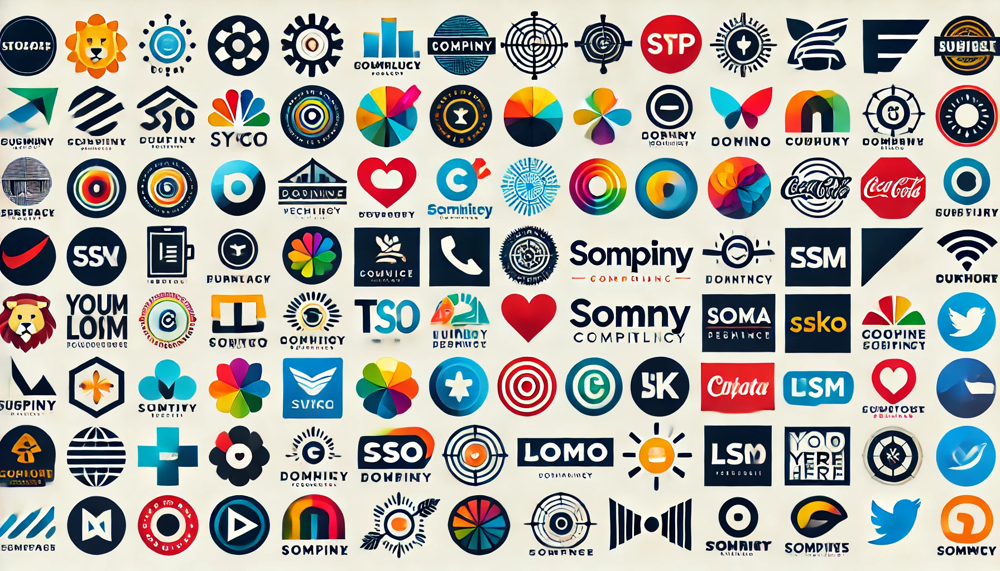

# 🔎 Image Search

 <b>SuperAI Season 4 | Level 1 | Hackathon 1</b>

 ใน Hackathon นี้ เป็น Hackathon เรื่อง <b>Image Search</b> หรือให้อธิบายง่าย ๆ ก็คือ มีข้อมูลที่เป็น <b>รูปภาพ</b> เข้ามาแล้วให้ทายว่ารูปภาพที่เข้ามานั้น <b>คล้ายกับ</b> รูปภาพใดใน folder queries ที่มีให้ คล้าย ๆ งาน Classification แต่เราจะใช้วิธีการที่เรียกว่า <b>Similarity Search</b> ในการตอบคำถามนี้ โดยสามารถติดตามวิธีการได้ใน Notebook ด้านล่างนี้เลยครับ

> **Task** : Similarity Search / Image Retrieval &nbsp;|&nbsp; **Tools** : CLIP (`openai/clip-vit-large-patch14`) , PyTorch , transformers

## 📓 ไฟล์ในโฟลเดอร์นี้

- [`Image_Search.ipynb`](./Image_Search.ipynb) — Unzip → Explore → Rename รูป → สกัด Embedding ด้วย CLIP → วัดความคล้าย

## 🔄 Update 2026

 🚧 ส่วนนี้เอาไว้บันทึกตอนที่กลับมาทำโจทย์นี้ใหม่ในปี 2026 นะครับ ว่าถ้าทำวันนี้จะทำต่างจากเดิมยังไงบ้าง

<ul>
 <li><b>สิ่งที่เปลี่ยนไป</b> : <i>(ยังไม่ได้เขียน)</i></li>
 <li><b>โมเดล / เครื่องมือใหม่ที่ลอง</b> : <i>(ยังไม่ได้เขียน)</i></li>
 <li><b>ผลลัพธ์ที่ได้</b> : <i>(ยังไม่ได้เขียน)</i></li>
</ul>

 <a href="../../README.md">⬅️ กลับไปหน้าหลัก</a>

