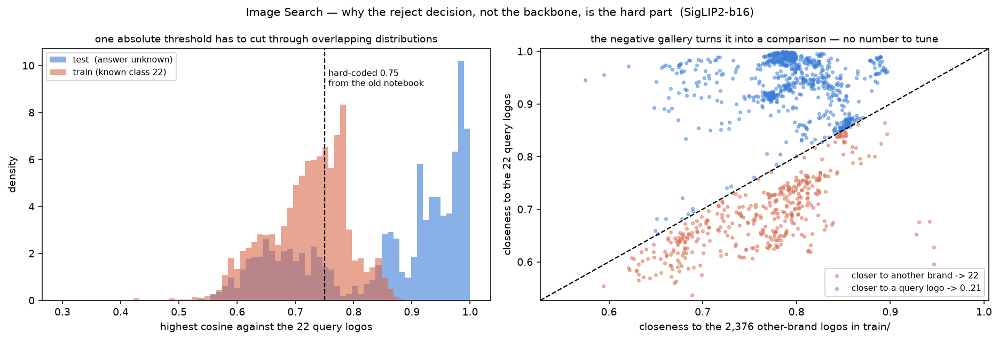

# 🔎 Image Search

<p>
 <b>SuperAI Season 4 | Level 1 | Hackathon 1</b> &nbsp;·&nbsp; <i>Python-first rebuild (2026)</i>
</p>

<p>
 โจทย์ให้ <b>โลโก้อ้างอิงมา 22 รูป</b> (คลาสละ 1 รูป) แล้วให้ทายว่าภาพใน test อีก 1,120 รูป
 เป็นโลโก้ตัวไหนใน 22 ตัวนั้น — หรือ <b>ไม่ตรงสักอัน</b> ซึ่งต้องตอบ <b>คลาส 22</b><br>
 ทั้งหมดนี้ทำแบบ <b>zero-shot</b> ล้วน ๆ ไม่มีการเทรนหรือ fine-tune อะไรเลย มีแค่
 backbone ที่ pretrain มาแล้ว + การจับคู่ด้วย cosine similarity
</p>

> **Task** : Zero-shot Logo Retrieval (open-set) &nbsp;|&nbsp; **Tools** : SigLIP 2 · transformers · open_clip · PyTorch

<hr>

## 🔁 รอบนี้ต่างจากเดิมยังไง

| | รอบเดิม | รอบนี้ |
|---|---|---|
| รูปแบบโค้ด | Notebook อย่างเดียว | **Python package** (`src/img_search/`) + CLI, notebook ไว้ทำ EDA เท่านั้น |
| โมเดล | CLIP ViT-L/14 ตัวเดียว | **benchmark 16 encoders** แล้วให้ข้อมูลเลือก |
| ตัดสินคลาส 22 | ฮาร์ดโค้ด `cosine > 0.75` | **negative gallery** + threshold ที่จูนจากข้อมูล |
| ใช้ `train/` ที่โจทย์แจกมา | ไม่ได้แตะเลย | เป็นทั้ง **validation set** และ **negative gallery** |
| วัดผล | ส่ง Kaggle แล้วดูคะแนน | **5-fold proxy** จาก `train/` วัดได้เองก่อนส่ง |
| Reproduce | ต้องมีข้อมูลอยู่แล้ว | `make setup && make data && make predict` จบ |
| Git | ข้อมูล/embedding หลุดเข้า repo ได้ | `datasets/` `models/` `submissions/` `.venv/` ถูก **gitignore** ทั้งหมด |

<hr>

## 🧠 แนวคิด : แยกงานเป็นสองคำถาม

<p>
 โจทย์นี้ดูเหมือนงาน similarity search ธรรมดา แต่จริง ๆ มีสองคำถามที่ไม่เหมือนกันเลยซ่อนอยู่
</p>

| | คำถาม | ตัวแปรที่คุม |
|---|---|---|
| **1. Rank** | ในโลโก้ 22 อัน อันไหนใกล้ที่สุด | เลือก encoder |
| **2. Reject** | ใกล้พอจะนับว่า "ตรง" ไหม หรือควรตอบ 22 | เลือกกฎตัดสิน |

<p>
 ข้อ 1 นั้น <b>แทบไม่ใช่ปัญหา</b> — SigLIP2-so400m เลือกคลาสถูก <b>97.6%</b> เมื่อดูเฉพาะภาพที่มีคำตอบจริง<br>
 ปัญหาทั้งหมดอยู่ที่ข้อ 2 และ notebook รอบเดิมตัดสินด้วยเลขที่ฮาร์ดโค้ดไว้ตัวเดียว
</p>



<p>
 <b>ซ้าย</b> — การกระจายของ "คะแนนสูงสุดเทียบกับโลโก้ 22 รูป" ของภาพ test (ไม่รู้คำตอบ)
 เทียบกับภาพใน <code>train/</code> ที่<b>รู้แน่ ๆ ว่าเป็นคลาส 22</b> มันทับกันหนัก
 ไม่ว่าจะลากเส้นตรงไหนก็ต้องเสียอย่างใดอย่างหนึ่ง<br>
 <b>ขวา</b> — พอเอา <code>train/</code> มาเป็น <b>negative gallery</b> คำถามเปลี่ยนจาก
 <i>"คล้ายพอหรือยัง"</i> (ต้องมีเส้นสัมบูรณ์) เป็น <i>"ใกล้โลโก้ที่ถาม หรือใกล้โลโก้แบรนด์อื่นมากกว่ากัน"</i>
 ซึ่งเป็นการ <b>เปรียบเทียบ</b> — เส้นแบ่งอยู่ที่เส้นทแยงมุมโดยไม่ต้องจูนอะไรเลย
</p>

<hr>

## 🗝️ กุญแจของรอบนี้ : `train/` ที่ไม่มีใครใช้

<p>
 โจทย์แจก <code>train/train/&lt;แบรนด์&gt;/*.jpg</code> มา <b>173 โฟลเดอร์ 2,377 รูป</b>
 แต่ไม่มีโฟลเดอร์ไหน<b>บอกว่าตรงกับ query ไหน</b> — notebook รอบเดิมเลยข้ามไปทั้งก้อน
</p>

<p>
 พอเปิดดูจริง ๆ ข้างในคือคลังโลโก้ของ <b>แบรนด์อื่น</b> (Gourmet Market, UNIQLO, KING POWER,
 adidas, Häagen-Dazs, AIS Fibre, ...) หน้าตาเหมือน test เป๊ะ แค่ไม่ใช่ 22 แบรนด์ที่ถาม<br>
 ซึ่ง <b>ดีกว่าการเป็นชุดเทรนเสียอีก</b> เพราะมันคือของสองอย่างที่เราขาดพอดี:
</p>

### 1. Negative gallery — ทำให้ "คลาส 22" มีตัวแทนจริง

<p>
 แทนที่คลาส 22 จะเป็นแค่ "ที่ที่ threshold ตัดทิ้ง" มันกลายเป็นคลาสที่มีตัวอย่างจริง 2,376 รูป
 ภาพ test ที่เพื่อนบ้านใกล้สุดเป็นโลโก้แบรนด์อื่น ก็คือคลาส 22 ตรง ๆ
</p>

### 2. Proxy validation — วัดผลได้เองโดยไม่ต้องส่ง Kaggle

<p>
 <code>train/</code> มีโครงสร้างเหมือนโจทย์เป๊ะ แค่เปลี่ยนชื่อแบรนด์ เราจึงจำลองโจทย์ขึ้นมาเองได้
 (<code>src/img_search/proxy.py</code>) :
</p>

```
สุ่ม 22 โฟลเดอร์มาเป็นคลาสปลอม  ->  หยิบโฟลเดอร์ละ 1 รูปเป็น "query"
                                    รูปที่เหลือของโฟลเดอร์นั้นคือคำตอบที่ถูก
โฟลเดอร์ที่เหลืออีก ~151 อัน      ->  คลาส 22
     85% เป็นแบรนด์ที่ "เคยเห็น" — รูป 95% ของมันอยู่ใน gallery ที่เหลืออยู่ใน validation
     15% เป็นแบรนด์ที่ "ไม่เคยเห็น" เลย — อยู่ใน validation ล้วน
```

<p>
 ได้ validation ที่มี label จริง <b>~1,620 รูปต่อ fold</b> (known 1,122 / unknown 499)
 โดยไม่แตะ test เลยสักภาพ ส่วน negative gallery มี 734 รูป<br>
 <b>สัดส่วน 95/85 ถูกเลือกให้ negative gallery ใหญ่ที่สุดเท่าที่ทำได้</b> เพราะ production ใช้ 2,376 รูป
 และคะแนน <code>max</code> ของฝั่งลบโตตามจำนวนรูป — ถ้า proxy มี gallery เล็กกว่ามาก threshold ที่จูนได้จะย้ายมาใช้ไม่ตรง
 และเพราะคลาสปลอมถูกสุ่มใหม่ทุก fold ผลจึงไม่ผูกกับแบรนด์ชุดใดชุดหนึ่ง<br>
 <b>threshold ถูกเลือกแบบ cross-fold</b> (จูนบน fold อื่น เอามาใช้กับ fold นี้)
 ตัวเลขทุกตัวข้างล่างจึงเป็นสิ่งที่คาดว่าจะได้ตอนเจอข้อมูลใหม่ ไม่ใช่ค่าที่ดีที่สุดเมื่อรู้คำตอบแล้ว
</p>

<hr>

## 📊 ผลการทดลอง (5-fold proxy)

### เลือก encoder

<p>
 ทุกตัวเป็น zero-shot ล้วน ใช้ pipeline การจับคู่แบบเดียวกันหมด ต่างกันแค่ backbone
</p>

| encoder | params | acc | balanced | retrieval | reject AUROC |
|---|---:|---|---|---|---|
| **`siglip2-b16`** (google/siglip2-base-patch16-384) | 375M | **0.8997 ± 0.034** | **0.9052** | 0.9659 | **0.9505** |
| `clip-l14-336` | 428M | 0.8791 ± 0.024 | 0.8926 | 0.9626 | 0.9388 |
| `eva02-l14-336` | 304M | 0.8700 ± 0.031 | 0.8904 | 0.9631 | 0.9490 |
| `clip-l14-pooler` ← แบบที่ notebook เดิมใช้ | 304M | 0.8746 ± 0.029 | 0.8840 | 0.9626 | 0.9414 |
| `clip-l14` | 428M | 0.8656 ± 0.021 | 0.8830 | 0.9437 | 0.9304 |
| `siglip2-so400m` | 1.14B | 0.8725 ± 0.019 | 0.8805 | **0.9761** | 0.9350 |
| `clip-bigg-laion` | 2.5B | 0.8750 ± 0.025 | 0.8756 | 0.9794 | 0.9340 |
| `siglip2-g-opt` | 1.87B | 0.8622 ± 0.037 | 0.8734 | 0.9663 | 0.9449 |
| `siglip-so400m` (SigLIP 1) | 878M | 0.8457 ± 0.029 | 0.8686 | 0.9399 | 0.9404 |
| `clip-h14-laion` | 986M | 0.8596 ± 0.049 | 0.8610 | 0.9659 | 0.9317 |
| `clip-b32` ← baseline ที่โจทย์แจกมา | 151M | 0.8251 ± 0.020 | 0.8484 | 0.9553 | 0.9406 |
| `dinov3-l` | 304M | 0.8135 ± 0.036 | 0.8331 | 0.9198 | 0.8965 |
| `dinov3-b` | 86M | 0.6921 ± 0.032 | 0.7395 | 0.7793 | 0.7885 |
| `dinov2-b` | 86M | 0.6002 ± 0.039 | 0.7027 | 0.6548 | 0.7558 |
| `dinov2-g` | 1.14B | 0.6161 ± 0.042 | 0.6967 | 0.6874 | 0.7659 |
| `dinov2-l` | 304M | 0.6105 ± 0.051 | 0.6897 | 0.6886 | 0.7609 |

<p>
 <code>retrieval</code> = เลือกคลาสถูกไหมเมื่อดูเฉพาะภาพที่มีคำตอบจริง (ไม่เกี่ยวกับกฎ reject)<br>
 <code>reject AUROC</code> = คะแนนดิบแยก "เป็น 1 ใน 22" ออกจาก "ไม่ใช่" ได้ดีแค่ไหน
</p>

### แล้วผลของการเปลี่ยนวิธี vs เปลี่ยนโมเดล

| encoder | วิธีเดิม (threshold เดี่ยว) | วิธีนี้ (negative gallery + expansion) | ต่าง |
|---|---|---|---|
| `clip-l14-pooler` | 0.8594 | 0.8746 | +1.5 |
| `clip-b32` | 0.7410 | 0.8251 | **+8.4** |
| `clip-l14` | 0.8502 | 0.8656 | +1.5 |
| `dinov3-l` | 0.8167 | 0.8135 | −0.3 |
| **`siglip2-b16`** | 0.8540 | **0.8997** | **+4.6** |

<p>
 อ่านตารางนี้ตามคอลัมน์ : <b>ภายใต้วิธีเดิม การเปลี่ยนโมเดลแทบไม่ช่วยอะไรเลย</b>
 (0.850 – 0.859 สำหรับทุกตัวขนาด L) เพราะคอขวดคือกฎ reject ไม่ใช่คุณภาพ embedding<br>
 พอแก้กฎ reject แล้วคุณภาพ embedding ถึงจะโผล่ออกมา — และ SigLIP2 ทิ้งห่างมากที่สุด<br>
 <b>ยกเว้น DINOv3 ที่ไม่ได้อะไรเลย</b> — negative gallery ช่วยเฉพาะเมื่อ embedding แยก
 "แบรนด์เดียวกัน" ออกจาก "โลโก้หน้าตาคล้ายกัน" ได้อยู่แล้ว ถ้าแยกไม่ออก การเพิ่มโลโก้แบรนด์อื่น
 เข้าไปอีก 2,376 รูปก็คือการเพิ่มคู่แข่งที่มันแยกไม่ออก
</p>

### สะสมทีละขั้น (siglip2-b16)

| ขั้น | acc |
|---|---|
| 1. gallery = โลโก้ 22 รูป + center-crop + threshold เดี่ยว | 0.8540 |
| 2. + pad แทน center-crop | 0.8631 |
| 3. + **negative gallery** จาก `train/` | 0.8819 |
| 4. + **query expansion** | **0.8997** |

<hr>

## 🔬 การทดลองย่อย

### กฎตัดสินคลาส 22

| reject | acc | known acc | unknown recall |
|---|---|---|---|
| `gallery` อย่างเดียว | 0.8625 | 0.9254 | 0.6871 |
| `threshold` อย่างเดียว | 0.8955 | 0.9325 | 0.8022 |
| `ratio` อย่างเดียว (Lowe's ratio test) | 0.7955 | **0.9821** | 0.2767 |
| `threshold+ratio` | 0.9040 | 0.9378 | 0.8168 |
| **`gallery+threshold`** | 0.8997 | 0.8970 | **0.9135** |
| `gallery+threshold+ratio` | 0.8992 | 0.8967 | 0.9127 |

<p>
 ทั้งสองกฎจำเป็น และเสริมกันคนละทาง — <code>gallery</code> เก่งฝั่ง known (0.96) แต่ปล่อยผ่าน
 คลาส 22 เยอะ (unknown recall 0.687), <code>threshold</code> กลับกัน<br>
 <code>threshold+ratio</code> ได้ accuracy สูงกว่า <code>gallery+threshold</code> เล็กน้อย (0.904 vs 0.900)
 แต่<b>เล็กกว่า std ระหว่าง fold (±3.4 จุด)</b> และเสีย unknown recall ไป 10 จุด<br>
 ค่า default จึงเป็น <code>gallery+threshold</code> ที่สมดุลสองฝั่งที่สุด — ซึ่งสำคัญเพราะเราไม่รู้ว่า
 สัดส่วนคลาส 22 ใน test จริงเป็นเท่าไร
</p>

### Query expansion — เอาคำตอบที่มั่นใจกลับเข้า gallery

<p>
 คลาสหนึ่งมีโลโก้อ้างอิง <b>รูปเดียว</b> ที่เกลี้ยงมาก แต่ภาพจริงของแบรนด์เดียวกันมีหลายเวอร์ชัน
 (สีต่าง ครอปต่าง มีสโลแกนพ่วง) พอทายรอบแรกแล้วเอาภาพที่มั่นใจสุดกลับเข้า gallery
 คลาสนั้นก็ครอบคลุมความหลากหลายขึ้น แล้วรอบสองจะเก็บตัวก้ำกึ่งได้เพิ่ม<br>
 ใช้แค่ <b>ภาพ</b> ของ test ไม่ได้ใช้ label — เป็นเทคนิค transductive มาตรฐานของงาน retrieval
</p>

| `expand_frac` | acc | known acc | unknown recall |
|---|---|---|---|
| 0.0 (ปิด) | 0.8819 | 0.8588 | 0.9486 |
| 0.1 | 0.8981 | 0.8854 | 0.9430 |
| 0.2 | 0.9005 | 0.8925 | 0.9310 |
| **0.33** | 0.8997 | 0.8970 | 0.9135 |
| 0.5 | 0.8880 | 0.9012 | 0.8613 |
| 0.75 | 0.8806 | 0.9020 | 0.8323 |
| 1.0 | 0.8629 | 0.8534 | 0.8912 |

<p>
 มี sweet spot ชัดเจน — ใส่น้อยไปไม่ได้อะไร ใส่มากไปคือการป้อนความผิดของตัวเองกลับเข้าไปสะสม
 ค่านี้ตั้งเป็น <b>สัดส่วนของขนาดกอง</b> ไม่ใช่จำนวนคงที่ เพราะ proxy มี ~2,000 ภาพ
 แต่ test มี 1,120 — ถ้าใช้ k คงที่ที่จูนบน proxy จะแรงเกินไปเมื่อย้ายมาที่ test
</p>

### เรื่องที่ลองแล้วไม่ช่วย

| การทดลอง | ผล |
|---|---|
| **ensemble** (ทุกคู่/ทุกสามจาก 5 ตัวที่ดีที่สุด) | ไม่มีชุดไหนชนะ `siglip2-b16` เดี่ยว — ที่ใกล้สุด `siglip2-b16+clip-l14-336+siglip2-so400m` ได้ balanced 0.9007 vs 0.9052 |
| **ตระกูล DINO ใน ensemble** | ตกทุกครั้ง |
| **ขยาย negative gallery ด้วย test** (`expand_negatives`) | 0.8997 → 0.8985 |
| **`aggregate`** max / topk / proto | 0.8997 / 0.9029 / 0.8993 — ไม่ต่าง (คลาสหนึ่งมีโลโก้อ้างอิงรูปเดียวอยู่แล้ว) |
| **`neg_quantile: 0.995`** แทน max | 0.9003 — ไม่ต่าง (ดูหัวข้อคะแนนจริงว่าทำไมถึงคิดว่ามันน่าจะช่วย) |
| **`expand_max_sim: 0.98`** (ขยายแบบเลี่ยงภาพซ้ำ) | 0.8839 — แย่ลง และแย่กว่านั้นมากบน test จริง |
| **multi-view TTA** (`pad`+`crop`+`squash`) | 0.9005 — เท่ากับใช้ `pad` อย่างเดียว (0.8997) |

<hr>

## 💡 สิ่งที่เรียนรู้

<p>
 <b>1. โมเดลใหญ่กว่าไม่ได้ดีกว่า</b> — <code>siglip2-b16</code> (375M) ชนะ
 <code>siglip2-g-opt</code> (1.87B) และ <code>clip-bigg-laion</code> (2.5B) ทั้งที่เล็กกว่า 5-7 เท่า<br>
 สิ่งที่ตรงกันในกลุ่มที่ทำได้ดีคือ <b>ความละเอียดอินพุต</b> ไม่ใช่จำนวนพารามิเตอร์ :
 <code>clip-l14-336</code> (0.879) ชนะ <code>clip-l14</code> ที่ 224px (0.866) ทั้งที่เป็นโมเดลเดียวกัน
 ต่างกันแค่ resolution และตัวที่ชนะทั้งหมดในตารางล้วนรับอินพุต 336-384px —
 โลโก้เป็นงานที่ต้อง<b>อ่านตัวอักษรเล็ก ๆ</b> pixel จึงสำคัญกว่า capacity
</p>

<p>
 <b>2. ตระกูล DINO แพ้ยับทั้งที่ควรจะเก่งเรื่องนี้</b> — DINOv2 คือมาตรฐานของงาน instance retrieval
 แต่ที่นี่ได้แค่ 0.65-0.69 ตกจากตระกูล CLIP ราว <b>25 จุด</b> และ retrieval accuracy แค่ 0.68 (CLIP 0.96+)<br>
 เหตุผล: โลโก้ส่วนใหญ่คือ <b>ตัวอักษร</b> (MaxValu, LOUIS VUITTON, EMPORIUM, SUBWAY)
 DINO เทรนแบบ self-supervised บนภาพธรรมชาติ ไม่เคยถูกบังคับให้อ่านตัวหนังสือ
 ส่วน CLIP/SigLIP เทรนกับ alt-text จึงได้ความสามารถ OCR มาแบบแถม ๆ

| | retrieval acc | acc |
|---|---|---|
| `dinov2-l` | 0.6886 | 0.6105 |
| `dinov3-l` (ขนาดเท่ากัน) | **0.9198** | **0.8135** |

 <b>DINOv3 ปิดช่องว่างนี้ไปได้เกินครึ่ง</b> (+20 จุด จาก DINOv2 ที่ขนาดเท่ากัน) ซึ่งตรงกับที่เปเปอร์
 เคลมว่าแก้เรื่อง dense feature ที่เสื่อมตอนเทรนยาว — แต่ก็ยังตามหลัง SigLIP2 อยู่ <b>9 จุด</b><br>
 <b>บทเรียน: "โมเดลที่ SOTA ในงานประเภทนี้" ไม่ได้แปลว่าจะชนะในงานของเรา</b>
</p>

<p>
 <b>3. คอขวดอยู่ที่การตัดสินใจ ไม่ใช่ที่ representation</b> — SigLIP2-so400m เลือกคลาสถูก
 <b>97.6%</b> แต่ accuracy รวมอยู่ที่ 0.873 ช่องว่าง 10 จุดนั้นคือเรื่อง reject ล้วน ๆ<br>
 จูนกฎ reject ให้ดีขึ้นได้ +4.6 จุด ส่วนจูนโมเดลได้ +2 จุด — และถ้าไม่แก้กฎ reject ก่อน
 การเปลี่ยนโมเดลจะ<b>วัดไม่เห็นเลย</b> (ดูตารางที่สอง)
</p>

<p>
 <b>4. ข้อมูลที่ "ไม่มี label" มักมีค่ามากกว่าที่คิด</b> — <code>train/</code> ไม่มีคลาสไหนตรงกับ
 22 คลาสที่ถามเลยสักอัน จึงดูเหมือนใช้ไม่ได้ แต่กลับให้ทั้ง negative gallery (+1.9 จุด)
 และ validation ที่ทำให้จูนทุกอย่างที่เหลือได้อย่างมั่นใจ<br>
 คำถามที่ควรถามไม่ใช่ <i>"ข้อมูลก้อนนี้มี label ที่เราต้องการไหม"</i>
 แต่เป็น <i>"ข้อมูลก้อนนี้มีโครงสร้างเหมือนโจทย์ไหม"</i>
</p>

<p>
 <b>5. <code>pooler_output</code> ที่ notebook เดิมใช้ ไม่ใช่ความผิดพลาด</b> — ตอนแรกคิดว่าเป็นบั๊ก
 เพราะ CLIP วัดความคล้ายในสเปซหลัง projection ไม่ใช่ก่อน แต่พอวัดจริง <code>clip-l14-pooler</code>
 (0.8746) <b>ชนะ</b> <code>clip-l14</code> ที่ใช้ embedding หลัง projection (0.8656) ทั้งที่<br>
 เป็นอินพุต 224px เหมือนกัน (ส่วนต่างนี้เล็กกว่า std จึงบอกได้แค่ว่า "ไม่แย่กว่า")<br>
 projection head ของ CLIP ถูกเทรนมาให้ align กับ <i>ข้อความ</i> ซึ่งเป็นการโยนข้อมูลเชิงภาพทิ้งไปบางส่วน
 งานเทียบภาพกับภาพจึงได้ประโยชน์จาก feature ก่อน projection มากกว่า
</p>

<p>
 <b>6. ระวังการเชื่อคะแนน cosine ว่าเป็น "แบรนด์เดียวกัน"</b> — ตอนตรวจว่ามีโฟลเดอร์ไหนใน
 <code>train/</code> เป็นแบรนด์เดียวกับ query บ้าง คะแนนสูงสุดคือ Honda ↔ Acura ที่ <b>0.87</b>
 (คนละแบรนด์) ส่วนคู่ที่เป็นแบรนด์เดียวกันจริง (Taco Bell ↔ โฟลเดอร์ 214) ได้ 0.78
 ต่ำกว่า Taco Bell ↔ McDonald's ที่ 0.83 และ ↔ Domino's ที่ 0.81 เสียอีก<br>
 <b>ไม่มี threshold ไหนแยกสองอย่างนี้ออกจากกันได้</b> — ต้องเปิดดูด้วยตา
 (<code>scripts/visualize.py map</code>) แล้ว freeze ผลลงไฟล์ ซึ่งก็คือสิ่งที่
 <code>configs/query_map.yaml</code> เป็น
</p>

<hr>

## 🏁 คะแนนจริงบน Kaggle

| submission | public | private |
|---|---|---|
| ของเดิม (SigLIP, 2025-06) | **0.93571** | **0.94464** |
| **รอบนี้** (siglip2-b16 + negative gallery + query expansion) | 0.89107 | 0.93392 |

<p>
 <b>private ตรงกับที่ proxy ทำนายไว้แทบเป๊ะ</b> (0.9339 จริง vs 0.9343 ที่ proxy บอกตอนนั้น) —
 ซึ่งเป็นหลักฐานว่าวิธีวัดผลใช้ได้จริง<br>
 แต่ <b>public ต่ำกว่า private ถึง 4.3 จุด</b> ทั้งที่ submission เก่าทุกอันมีช่องว่างแค่ 0.5-2.3 จุด
 และยังแพ้ของเดิมอยู่ จึงไล่หาสาเหตุต่อ
</p>

### สิ่งที่เจอตอนเปิดดูคำทำนายจริง

<p>
 ความผิดพลาดกระจุกอยู่ที่ <b>สองคลาส</b> และเป็นชนิดเดียวกัน — โลโก้คนละแบรนด์ที่หน้าตาเป็นประเภทเดียวกัน
</p>

| คลาส | ภาพที่ดูดเข้ามาผิด | จำนวน | คะแนน |
|---|---|---|---|
| 3 (วงกลมแดง + ต้นไม้เขียว) | โลโก้ธนาคารกรุงเทพ (วงกลมน้ำเงิน + ใบไม้ขาว) | ~60 | 0.83-0.88 |
| 6 (LOUIS VUITTON) | SAINT LAURENT, GUCCI, BOTTEGA VENETA | ~16 | 0.84-0.89 |

<p>
 รวมราว <b>76 ภาพ = 6.8% ของ test</b> ซึ่งมากพอจะอธิบายช่องว่างได้ทั้งหมด<br>
 ตัวเลขคะแนนบอกว่า encoder <i>แยกออก</i> อยู่แล้ว (ของจริงของคลาส 3 อยู่ที่ 0.94-1.00
 ส่วนธนาคารกรุงเทพสูงสุด 0.88) — <b>threshold 0.842 ที่จูนจาก proxy ต่ำเกินไปสำหรับ test ชุดนี้</b>
</p>

<p>
 สาเหตุที่ proxy ให้ threshold ต่ำ: ใน proxy โลโก้อ้างอิงเป็นรูปสุ่มจากโฟลเดอร์ ภาพที่ตรงกันจึงได้คะแนน
 <i>ปานกลาง</i> แต่ใน test จริง ภาพจำนวนมาก <b>เป็นไฟล์เดียวกับ query เลย</b> (34% ได้คะแนน ≥ 0.97)
 การกระจายคะแนนจึงคนละรูปทรงกัน — เป็นข้อจำกัดของ proxy ที่แก้ไม่ได้ด้วยการหั่น fold ใหม่
</p>

### สี่วิธีที่ลองแก้แล้ว **แย่ลงทุกอัน**

<p>
 ทุกข้อผ่านการเปิดดูภาพจริงที่เปลี่ยนไป ไม่ได้ดูแค่ metric
</p>

| ที่ลอง | เหตุผลที่คิดว่าจะช่วย | ผลจริง |
|---|---|---|
| `expand_reject: none` (ให้ query expansion หยิบ top-k จาก argmax ล้วน) | คลาสที่ query คุณภาพแย่ (เช่น Starbucks ขาวดำ) ถูก negative gallery วีโต้ตั้งแต่รอบแรก ภาพดี ๆ เลยไม่มีวันได้เข้า gallery | เปลี่ยน 100 ภาพ และ **ผิดเกือบทั้งหมด** — AIS→q0/q21, CENTRAL/THE MALL→q2, DONKI→q19, phawan→q15 |
| `expand_max_sim: 0.98` (ขยายแบบเลือกภาพที่หลากหลาย ไม่เอาสำเนาซ้ำ) | โควตา k ถูกใช้ไปกับสำเนาของ query เอง เวอร์ชันจริงที่ต่างออกไปเลยไม่ได้เข้า | แยก Starbucks เขียวออกจากธนาคารกรุงเทพได้จริง (+0.027) **แต่** BOTTEGA VENETA→q6, KERRY→q14, AIS→q21 พุ่งขึ้นไป 0.96-1.00 — error amplification |
| `neg_quantile < 1.0` (เลิกใช้ max บน negative gallery) | max เหนือ 2,376 รูปมี extreme-value bias และเอนมากขึ้นตามขนาด gallery | ช่วยชัดเจนบน proxy รุ่นที่ validation ไม่มีแบรนด์แปลกหน้า — พอทำ proxy ให้ซื่อสัตย์ขึ้น ผลหายไปจนจมใน noise |
| `expand_negatives: true` | คลาส 22 ควรได้ตัวแทนจากโดเมนเดียวกับ test ด้วย | ไม่ขยับ (0.8997 → 0.8985) |

<p>
 <b>บทเรียนร่วมของทั้งสี่ข้อ</b>: กฎ reject ที่เข้มงวด + การขยาย gallery ที่ยอมให้มีภาพซ้ำ
 ทำหน้าที่เป็น <b>กันชน</b> อยู่ ทุกครั้งที่ผ่อนอย่างใดอย่างหนึ่ง ภาพแบรนด์อื่นจะหลุดเข้า gallery
 แล้ว <b>ดึงพวกเดียวกันตามเข้ามาอีก</b> — query expansion ขยายทั้งสิ่งที่ถูกและสิ่งที่ผิดเท่ากัน
</p>

<p>
 สิ่งที่<b>น่าจะ</b>ช่วยจริงคือ threshold ที่สูงขึ้น (~0.89) หรือ threshold แยกรายคลาส
 แต่ยังไม่ได้ทำ เพราะจะเป็นการจูนจากการนั่งดูภาพ test ราว 80 รูปด้วยตาตัวเอง
 ซึ่งไม่ต่างจากการ fit กับ leaderboard — ขอบันทึกไว้เป็นงานต่อไปที่ต้องหาวิธีตัดสินที่ไม่ใช้ test แทน
</p>

<hr>

## ⚠️ เรื่องวิธีวัดผล

<p>
 ตัวเลขทุกตัวในหน้านี้มาจาก <b>proxy 5 fold</b> ที่สร้างจาก <code>train/</code> ไม่ใช่คะแนน Kaggle
 ข้อจำกัดที่ต้องรู้ :
</p>

<p>
 <b>1. std ระหว่าง fold อยู่ที่ ±1.9 ถึง ±5.1 จุด</b> — ส่วนต่างที่เล็กกว่านั้นไม่ควรถือว่าต่างจริง
 อันดับ 2-10 ในตารางแรก (0.8457 – 0.8791) อยู่ในช่วง noise ของกันและกันเกือบทั้งหมด
 ที่พอพูดได้คือ <code>siglip2-b16</code> นำอยู่ราว 2 จุด และตระกูล DINO ตามหลังชัดเจนเกินกว่าจะเป็น noise
</p>

<p>
 <b>2. proxy ไม่ใช่ test</b> — แบรนด์ใน proxy เป็นคนละชุดกับ 22 แบรนด์ที่ถามจริง
 สัดส่วนคลาส 22 ก็ไม่เท่ากัน (proxy ~50%, test ไม่รู้) การเลือก threshold จึงใช้เกณฑ์
 <code>balanced</code> (เฉลี่ย known-acc กับ unknown-recall) ซึ่ง<b>ไม่ขึ้นกับสัดส่วนคลาส</b>
 แทนที่จะเป็น accuracy ตรง ๆ
</p>

<p>
 <b>3. gallery ตอน predict ใหญ่กว่าตอนวัด</b> — proxy ใช้โฟลเดอร์ฝั่งลบราวครึ่งเดียว
 แต่ตอน predict ใช้ทั้ง 173 โฟลเดอร์ คะแนน negative จึงสูงกว่าเล็กน้อยกว่าตอนจูน
 เป็นความคลาดเคลื่อนที่รู้ตัวและยอมรับ เพื่อแลกกับ gallery ที่ครบกว่า
</p>

<hr>

## 🚀 วิธีใช้งาน

**ต้องมีก่อน** : [`uv`](https://docs.astral.sh/uv/) และ Kaggle account

```bash
# 0) ติดตั้ง Kaggle CLI + login (ทำครั้งเดียวต่อเครื่อง)
uv tool install kaggle
kaggle auth login

# 1) สร้าง environment (.venv ถูก gitignore ไว้)
make setup

# 2) โหลดข้อมูลจาก Kaggle ลง datasets/
#    ⚠️ ต้องกด Join Competition ที่หน้า rules ก่อน ไม่งั้นจะขึ้น 403
#    https://www.kaggle.com/competitions/image-search
make data

# 3) เช็คว่าทุกอย่างเดินครบทุกขั้นตอน (ใช้เวลาไม่ถึงนาที)
make smoke

# 4) สร้าง submission ด้วยค่าที่ดีที่สุด
make predict
```

<p>
 อยากทำซ้ำการทดลองทั้งหมด :
</p>

```bash
make embed                                      # สกัด embedding ของ encoder ที่ตั้งไว้
uv run img-embed --all                          # ...หรือทุกตัวใน registry
make benchmark                                  # ตารางเปรียบเทียบ encoder
make map                                        # หาโฟลเดอร์ใน train/ ที่เป็นแบรนด์เดียวกับ query

uv run python scripts/ablate.py reject expand_frac views aggregate
uv run python scripts/ablate.py ensemble --models siglip2-b16 siglip2-so400m clip-l14-336
uv run python scripts/visualize.py queries      # โลโก้ 22 รูปที่ถาม
uv run python scripts/visualize.py map          # ตรวจ query_map.yaml ด้วยตา
uv run python scripts/visualize.py errors       # ภาพที่ทายผิดบน proxy
uv run python scripts/visualize.py test         # ตัวอย่างคำทำนายบน test
```

<p>
 เปลี่ยนค่า config ชั่วคราวได้ทุกคำสั่งด้วย <code>--set</code> :
</p>

```bash
uv run img-predict --set 'embed.models=[siglip2-so400m]' --set gallery.expand_frac=0.2
make benchmark SET="--set benchmark.folds=10"
```

<hr>

## 📁 โครงสร้างโปรเจกต์

```
configs/
  default.yaml          ค่าทั้งหมดอยู่ที่นี่ที่เดียว
  query_map.yaml        คลาส -> โฟลเดอร์ใน train/ ที่เป็นแบรนด์เดียวกัน (ตรวจด้วยตาแล้ว)
src/img_search/
  data.py               โหลดจาก Kaggle + index ไฟล์
  encoders.py           registry ของ 16 encoder + วิธี preprocess (pad / squash / crop)
  embed.py              cache embedding ลงดิสก์ + ถอยไป CPU อัตโนมัติเมื่อ VRAM ไม่พอ
  proxy.py              สร้าง pseudo-task จาก train/ ← หัวใจของการวัดผล
  gallery.py            ประกอบ gallery: queries + train ที่ map ได้ + negatives
  match.py              คะแนนต่อคลาส, กฎ reject, query expansion, metrics
  benchmark.py          วัดทุก encoder แบบ cross-fold threshold
  predict.py            จูน threshold แล้วเขียน submission
notebooks/
  01_eda.ipynb          สำรวจข้อมูล + ทำไม threshold เดี่ยวถึงเปราะ
  00_legacy_clip_notebook.ipynb   notebook รอบเดิม เก็บไว้เทียบ
scripts/
  ablate.py             sweep ทีละพารามิเตอร์บน proxy
  visualize.py          รูปสำหรับตรวจงานด้วยตา
  smoke_test.py         เช็ค 20 อย่างตั้งแต่ index ถึง submission
```

<hr>

## 🔧 หมายเหตุ

<p>
 <b>VRAM</b> — วัดบน RTX 3080 Ti Mobile (16 GB) การสกัด embedding ของทั้ง dataset
 (3,519 ภาพ) ใช้เวลาตั้งแต่ 5 วินาที (clip-b32) ถึงราว 6 นาที (clip-bigg-laion 2.5B รวมเวลาโหลด weight ครั้งแรก)
 ถ้า VRAM ไม่พอ <code>embed.py</code> จะลด batch ลงครึ่งหนึ่งไปเรื่อย ๆ แล้วค่อยถอยไป CPU เอง
 เมื่อ embedding ถูก cache แล้ว ทุกการทดลองที่เหลือใช้เวลา <b>2-3 วินาทีต่อ encoder</b> บน CPU
</p>

<p>
 <b>DINOv3 เป็น gated repo</b> — <code>dinov3-b</code> / <code>dinov3-l</code> ต้องกด accept license
 ที่หน้า HF แล้ว <code>hf auth login</code> ก่อน ไม่งั้นจะถูกข้ามพร้อมข้อความบอกเหตุผล
</p>

<p>
 <b>ทำไมต้อง bfloat16</b> — ตอนแรกใช้ float16 แล้ว <code>dinov3-l</code> ให้ embedding ที่เป็น
 <b>NaN ทั้ง 3,519 แถว</b> (activation ทะลุช่วงของ float16) แต่ metric ที่รายงานกลับไม่ได้ฟ้องอะไรชัด ๆ —
 accuracy เหลือ 0.026 ขณะที่ AUROC ยังขึ้น 0.92 เพราะ NaN ไป propagate ผ่าน argmax แบบเงียบ ๆ<br>
 ตอนนี้ <code>encoders.py</code> เลือก <b>bfloat16</b> เป็นค่าเริ่มต้นเมื่อการ์ดรองรับ
 (กินหน่วยความจำเท่า float16 แต่ช่วง exponent เท่า float32) และมี guard ที่<b>โยน error ทันที</b>
 เมื่อเจอค่าไม่ finite แล้วถอยไป float32 ให้เอง — ค่า NaN จะไม่มีวันถูกเขียนลง cache
</p>

<p align="center">
 <a href="../../README.md">⬅️ กลับไปหน้าหลัก</a>
</p>
