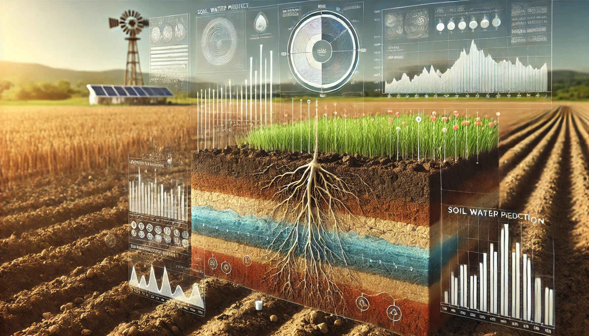

# 💧 Soil Water Prediction

 <b>SuperAI Season 4 | Level 1 | Hackathon 4</b>

 ใน Hackathon นี้ จะเป็นการทำ <b>Regression</b> ความชื้นในดินด้วยข้อมูล tabular ที่ได้รับมาในวันอื่น ๆ เป็น Hackathon ที่เน้นในการทำ Machine Learning และการวิเคราะห์ features โดยสามารถติดตามวิธีการได้ใน Notebook ด้านล่างนี้เลยครับ

> **Task** : Tabular Regression &nbsp;|&nbsp; **Tools** : AutoGluon , pandas

## 📓 ไฟล์ในโฟลเดอร์นี้

- [`Soil_Water_Prediction.ipynb`](./Soil_Water_Prediction.ipynb) — รวมไฟล์ด้วย glob → Explore Data → AutoGluon TabularPredictor

 <a href="../../README.md">⬅️ กลับไปหน้าหลัก</a>

