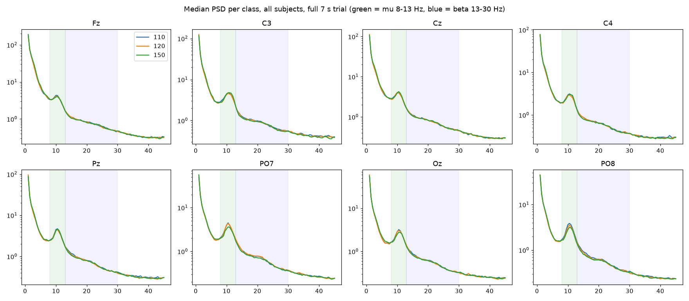
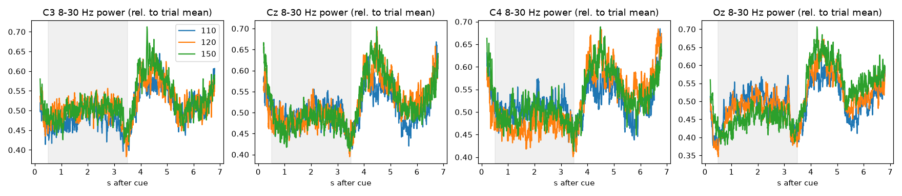

# 🧠 Brain Motor Imagery

<p>
 <b>SuperAI Season 4 | Level 2 | Hackathon 4</b> &nbsp;·&nbsp; <i>Python-first rebuild (2026)</i>
</p>

<p>
 ใน Hackathon นี้ นับเป็น Hackathon ที่ยากลำบากที่สุด เราได้รับบทเป็นคุณหมอที่ต้อง Classified จากสัญญาณสมอง (EEG) ว่าผู้ทดสอบกำลังจินตนาการว่าขยับ <b>มือซ้าย</b> <b>มือขวา</b> หรือ <b>พัก (rest)</b><br>
 รอบเดิมทีม Optimizer ได้ <b>0.315</b> บน leaderboard ขณะที่ baseline ของผู้จัดอยู่ที่ <b>0.565</b> และ <u>ไม่มีทีมไหนชนะ baseline ได้เลย</u> (ทีมที่ดีที่สุด 0.524) — รอบนี้เลยขอ research ให้พอก่อน แล้วค่อยลงมือ — ผลคือ <b>0.638 public / 0.607 private</b> ด้วยโมเดล EEG ล้วนตัวเดียว
</p>

> **Task** : EEG Motor-Imagery Classification (3 คลาส, cross-subject) &nbsp;|&nbsp; **Tools** : MNE · pyRiemann · braindecode · PyTorch

<hr>

## 🔁 รอบนี้ต่างจากเดิมยังไง

| | รอบเดิม | รอบนี้ |
|---|---|---|
| รูปแบบโค้ด | Notebook 2 ไฟล์ (preprocess + visualize/EEGNet) | **Python package** (`src/brain_mi/`) + CLI, notebook ไว้ทำ EDA เท่านั้น |
| Compute | Colab + HuggingFace dataset ส่งไปมา | **เครื่องตัวเอง** — RTX 3080 Ti Mobile 16 GB VRAM |
| ข้อมูล | แจกมาให้ | โหลดเองจาก **Kaggle** (`brain-motor-imagery-classification`) |
| Validation | random split บน chunk | **GroupKFold ตามคน** + `train_application` เป็น domain ที่สอง |
| Reproduce | ต้องมีข้อมูลอยู่แล้ว | `make setup && make data && make eda` |

<hr>

## 📚 Research ก่อนลงมือ (สรุปจากการอ่าน ~30 แหล่ง)

<p>
 <b>1. เครื่องคือ g.tec Unicorn Hybrid Black</b> — 8 ช่อง dry electrode (Fz, C3, Cz, C4, Pz, PO7, Oz, PO8) 250 Hz, DC-coupled จึงมี offset ระดับ −150,000 µV ลอยตลอดเวลา และไวต่อ 50 Hz มาก
 คำแนะนำจากผู้ผลิตและรีวิวอิสระตรงกัน : high-pass 0.5–1 Hz + notch 50 Hz + low-pass 30–40 Hz บนสัญญาณต่อเนื่อง <i>ก่อน</i> ตัด epoch
</p>

<p>
 <b>2. Riemannian geometry คือ baseline ที่แข็งที่สุดสำหรับข้อมูลน้อยและช่องน้อย</b> — benchmark ของ MOABB (30 pipeline × 36 dataset) และ benchmark 216k การทดลองในปี 2026 สรุปตรงกันว่า
 <code>Covariance → Tangent space → Logistic regression</code> กับ CSP เป็นสองตระกูลที่นำเสมอ ส่วน deep learning ต้องการข้อมูลเยอะกว่านี้ถึงจะแซง
 ผู้ชนะ Kaggle EEG ทั้งสองรายการ (BCI Challenge NER 2015, Grasp-and-Lift 2015) คือ Riemannian + bagging ตามคน
</p>

<p>
 <b>3. Cross-subject ตกจาก within-subject ราว 20 จุด</b> — บน BCI IV 2a โมเดลอย่าง ATCNet ได้ 83% within-subject แต่ 60% เมื่อทดสอบกับคนใหม่
 3 คลาสบน dry electrode 8 ช่องในงานวิจัยอยู่ราว 55–60% within-subject; cross-subject คาดได้ 40–55% (chance 33%)
</p>

<p>
 <b>4. Euclidean Alignment (He &amp; Wu 2020) คือเครื่องมือหลักสำหรับ domain shift</b> — whiten ทุก trial ด้วย R̄<sup>-1/2</sup> ของ "คน/session นั้น" โดยไม่ต้องใช้ label
 ทำกับ test ได้ตรง ๆ ถ้ารู้ว่า trial ไหนมาจาก session เดียวกัน (ซึ่งเรารู้ — ดู EDA) รายงานเพิ่ม +4–8 จุดในงาน cross-subject
</p>

<p>
 <b>5. Rest แยกง่าย ซ้าย/ขวาแยกยาก</b> — งานที่มี rest เป็นคลาสจะได้ rest-vs-MI สูงมากจาก alpha ที่ occipital แต่ L-vs-R บน 8 ช่องมักได้ 55–70% แม้ within-subject
 → ควรทำ <b>hierarchical classifier</b> แยกสองขั้น ใช้ช่อง/แบนด์คนละชุด
</p>

<p>
 <b>6. Augmentation ที่มีเหตุผลทางสรีรวิทยา</b> — cropped training / time-shift, FrequencyShift ±2 Hz (mu peak ต่างกันแต่ละคน), ChannelsDropout (dry electrode หลุดจริง), และ <b>Channel Reflection</b> (สลับ C3↔C4, PO7↔PO8 แล้วสลับ label ซ้าย↔ขวา — ได้ข้อมูล L/R เพิ่มเท่าตัวโดย label ยังถูกเป๊ะ)
</p>

<p>
 <b>7. กับดัก</b> — crop ซ้อนกันแล้ว random split (คะแนนหลอก), split ตาม trial แทนที่จะตามคน, blink ที่ Fz ทำนาย "ผิดเหตุผล", และ <b>ห้ามป้อนคอลัมน์ Counter/Battery ให้โมเดล</b> (leak)
</p>

<hr>

## 🔎 EDA — สิ่งที่พบ (`notebooks/01_eda.ipynb`)

### ข้อมูล

| | ค่า |
|---|---|
| train | 191 block · 19 คน · 2 session · **5,754 cue** → 5,737 epoch เต็ม 7 s (10 ต่อคลาสต่อ block) |
| test | **480 trial** = 16 block × 30 · ไม่มี subject id |
| trial | cue ทุก 7.00 s → epoch [cue, cue+1750 samples) ตรงกับไฟล์ test (1750–1752 แถว) |
| label | 110 / 120 / 150 สมดุลเป๊ะ · จาก ERD ที่ C3 : 150 = rest ค่อนข้างแน่ · 110/120 = ซ้าย/ขวา (ยังไม่รู้ว่าอันไหนซ้าย) |
| `*_application` | 180 trial มี label + 60 ไม่มี · **อีก 1 session ของคนใหม่** · ไม่อยู่ใน submission |

### 1. Test คือ "คนใหม่" — โจทย์นี้วัด cross-subject

<p>
 ใช้ DC offset 8 ช่อง (ลายนิ้วมือของการสวมหมวกแต่ละครั้ง) + คอลัมน์ sample counter + ระดับแบตเตอรี่ ประกอบ test trial กลับเป็น block ได้ <b>16 block × 30 trial ครบพอดี จาก 2 session</b>
 และทั้งสอง session อยู่ห่างจากทุก session ใน train มาก (ระยะ 34 และ 118 เทียบกับระยะระหว่าง block ใน session เดียวกัน median 11) ส่วน session ที่ใกล้ที่สุดก็มี block ครบ 8 ใน train อยู่แล้ว<br>
 → ต้อง validate ด้วย <b>GroupKFold ตาม subject</b> เท่านั้น ถ้าแบ่งตาม trial/block คะแนนจะสูงเกินจริง
</p>

### 2. สัญญาณมีอะไรให้เรียน



| ปรากฏการณ์ | ที่เห็นในข้อมูล |
|---|---|
| mu ERD ที่ C3 ตอน MI | log-ratio −0.06 / −0.07 (110 / 120 เทียบ rest) ✓ ตามทฤษฎี |
| alpha ที่ occipital | **สูงกว่าตอน MI** (+0.08 ถึง +0.16) — rest ในโจทย์นี้น่าจะเป็นตาเปิดมองจอ → แยก rest ได้จาก PO7/Oz/PO8 |
| lateralisation C3−C4 | 110 = 0.32, 120 = 0.35, 150 = 0.35 — **แทบไม่ต่าง** เมื่อรวมทุกคน |
| ต่อคน | ทิศทางของ feature เดียวกันกลับด้านในราวครึ่งหนึ่งของคน → โมเดล pooled ล้มเหลว, ต้อง align ต่อคน |
| เวลา | ERD เริ่ม ~0.5 s หลัง cue · ที่ ~3.5–4 s power กลับขึ้นพร้อมกันทุกคลาส (จบ task/feedback) → หน้าต่าง 0.5–3.5 s ดีกว่าใช้ทั้ง 7 s |
| noise | 50 Hz แรงกว่า 45 Hz 100–1000 เท่า · std ต่อ trial p99.9 ถึง 16,000 µV (artifact) → notch + robust clipping |

### 3. ⚠️ Leak ที่ต้องรู้ (และตัดสินใจว่าจะทำอย่างไร)

<p>
 ลำดับ cue ใน block เป็น <b>ลำดับตายตัว 30 ตัว</b> (189 block เหมือนกันเป๊ะ อีก 2 block คือลำดับเดิมที่ตัดสั้น/หาย cue แรก) และ test ประกอบกลับเป็น block <i>พร้อมลำดับ</i> ได้จาก counter
 → label ของ test อ่านออกได้จาก metadata โดยไม่ต้องดู EEG เลย<br>
 ตรวจสอบด้วยสรีรวิทยาแล้ว : ถ้าใช้ label จากลำดับ cue, occipital alpha ตอน MI สูงกว่า rest ในทุก block ของ test (z ≈ 7 เทียบกับสลับ label สุ่ม) — <b>leak นี้จริง</b>
 ผู้จัดลบ counter เป็น −1 เฉพาะในชุด <code>*_application</code> แต่ไม่ได้ลบใน <code>test/</code>
</p>

<p>
 <b>นโยบายที่เสนอ :</b> ใช้ label ชุดนี้เป็น <b>oracle วัดผลบนเครื่องเรา</b> (ได้ "test score" โดยไม่ต้องส่ง Kaggle) แต่ตัวโมเดลที่ส่งจะดูแค่ EEG 8 ช่อง —
 ไม่ป้อน counter/battery/DC ให้โมเดล ไม่ใช้ลำดับ cue ตอน predict
</p>

### 4. Baseline เมื่อแบ่ง fold ให้ตรงโจทย์ (5-fold, EA = Euclidean Alignment ต่อ session)

| pipeline | band · window | split by SUBJECT | + EA | split by BLOCK (เห็นคนแล้ว) | + EA |
|---|---|---|---|---|---|
| TS+LR | 8–30 Hz · 0–7 s | 0.377 | 0.384 | 0.410 | 0.402 |
| TS+LR | 8–30 Hz · 0.5–4.5 s | 0.408 | 0.418 | 0.447 | 0.454 |
| **TS+LR** | **8–30 Hz · 0.5–3.5 s** | **0.437** | **0.443** | 0.483 | **0.492** |
| TS+LR | 4–40 Hz · 0.5–4.5 s | 0.387 | 0.409 | 0.429 | 0.440 |
| TS+LR | 8–13 Hz · 0.5–4.5 s | 0.407 | 0.411 | 0.443 | 0.446 |
| TS+LR | 13–30 Hz · 0.5–4.5 s | 0.376 | 0.404 | 0.405 | 0.423 |
| MDM | 8–30 Hz · 0.5–4.5 s | — | 0.413 | — | — |
| CSP(6)+LR | 8–30 Hz · 0.5–4.5 s | — | 0.426 | — | 0.446 |
| FB-TS+LR (5 แบนด์ 4–40) | 0.5–4.5 s | — | 0.424 | — | 0.475 |
| EEGNet (braindecode) | 4–40 Hz · 0.5–4.5 s · 125 Hz | — | 0.471 | — | — |
| ShallowConvNet | 4–40 Hz · 0.5–4.5 s · 125 Hz | — | 0.481 | — | — |
| **EEG-Conformer** | 4–40 Hz · 0.5–4.5 s · 125 Hz | — | **0.489** | — | — |

<p>
 (ค่าคือ accuracy, macro-F1 ต่ำกว่าราว 0.005–0.02 · chance = 0.333)<br>
 <b>แยกเป็นโจทย์ย่อย (subject split + EA, 8–30 Hz, 0.5–4.5 s) :</b> rest-vs-MI = <b>0.643</b> · L-vs-R = <b>0.546</b> (chance 0.5 ทั้งคู่)<br>
 <b>อ่านผล :</b> ① หน้าต่างสั้นชนะ (0.5–3.5 s) ② EA ช่วยเล็กน้อยแต่สม่ำเสมอ ③ เห็นคนแล้วก็ยังได้แค่ ~0.49 — ข้อมูลนี้ยากจริงแม้ within-subject
 ④ ต่างจากงานวิจัยที่ rest แยกได้ง่าย ในข้อมูลนี้ <b>rest ก็ยาก</b> (0.64) — occipital alpha ต่อคนกลับด้านบ่อย
 ⑤ <b>Deep learning บนข้อมูลที่ EA แล้วชนะ Riemannian ใน cross-subject</b> (0.47–0.49 vs 0.44) แม้ยังไม่ได้จูนหรือ augment — สวนทางกับ benchmark ทั่วไป น่าจะเพราะ 8 ช่อง × 5.7k trial พอสำหรับโมเดลเล็ก
 ⑥ ทุกอย่างยังอยู่ต่ำกว่า baseline 0.565 ของผู้จัด → ต้องใช้ทุกอย่างในแผนรวมกัน ไม่มี silver bullet
</p>

<hr>

## 🗺️ แผนที่วางไว้ (เรียงตาม payoff ที่คาด) → ผลจริงอยู่หัวข้อถัดไป

| # | ขั้น | ทำอะไร | คาดหวัง |
|:-:|---|---|---|
| 0 | **Validation ที่เชื่อได้** | GroupKFold ตาม subject + วัดบน `train_application` (คนใหม่ 180 trial) + oracle บน test · รายงาน macro-F1 | ทุกการทดลองหลังจากนี้เทียบกันได้ |
| 1 | **Preprocess ให้ถูก** | high-pass 0.5 Hz → notch 50/100 → band 8–30 บนสัญญาณต่อเนื่อง · clip artifact · resample 125 Hz · sweep window (start 0–1.5 s, length 2–4 s) | +2–4 จุดจาก window อย่างเดียว |
| 2 | **Filter-bank tangent space** | แบนด์ 4–8 / 8–13 / 13–20 / 20–30 → 36 feature ต่อแบนด์ → LR/ElasticNet | baseline หลัก |
| 3 | **Alignment ต่อ session** | EA ต่อ session ใน train · ใน test ใช้ 2 กลุ่มที่ประกอบได้จาก EDA (หรือ cluster covariance ถ้าไม่มี counter) · เทียบ Riemannian re-centering | +3–8 จุด |
| 4 | **Hierarchical** | ขั้น 1 rest-vs-MI (occipital alpha + covariance เต็ม) · ขั้น 2 L-vs-R (C3/Cz/C4 mu+beta, ตัด Fz กัน blink) | ใช้ capacity ตรงที่ยาก |
| 5 | **Channel Reflection** | สลับ C3↔C4, PO7↔PO8 + สลับ label 110↔120 → ข้อมูล L/R ×2 | +1–3 จุดที่ L/R |
| 6 | **Deep learning (ตัวหลักคู่กับ Riemannian)** | EEG-Conformer / ShallowConvNet / EEGNet บนข้อมูลที่ EA แล้ว · window 0.5–3.5 s · cropped training · FrequencyShift · ChannelsDropout · mixup · test-time BN adaptation · ensemble หลาย seed | ดีที่สุดใน baseline (0.49) และยังไม่ได้จูน |
| 7 | **Bagging ตามคน** | เทรน 100+ โมเดลบน subset ของคน (แบบ Barachant NER 2015) แล้วเฉลี่ย probability | +1–3 จุด, ลด variance |
| 8 | **รวม `train_application` เข้า train** ตอนสุดท้าย | อีก 1 คน = +5% ข้อมูล ในโจทย์ที่ "จำนวนคน" คือคอขวด | เล็กน้อยแต่ฟรี |

<p>
 <b>เป้า :</b> ขั้น 1–3 ควรพา TS+LR จาก 0.44 ไปแถว 0.50 และพา Conformer จาก 0.49 ขึ้นไปอีก · ขั้น 4–7 (โดยเฉพาะ augmentation + ensemble ของ DL) คือส่วนที่จะพาไปชนกับ 0.565 ของผู้จัด
 ถ้ายังไม่ถึง ให้ดูขั้น 3 ก่อนเสมอ (alignment คือตัวแปรที่ใหญ่ที่สุดในงาน cross-subject)
</p>

<hr>

## 🧪 ผลการทดลอง (pipeline จริง `src/brain_mi/`)

<p>
 ทุกแถวคือ <code>scripts/ablate.py</code> หนึ่ง variant · ค่าเริ่มต้น = TS+LR, high-pass 0.5 + notch 50/100 + band 8–30 Hz, 125 Hz, หน้าต่าง 0.5–3.5 s,
 Euclidean Alignment ต่อ session (train) / ต่อ cluster ของ covariance (test)<br>
 <b>3 ชั้นของ validation :</b> ① <b>CV</b> = GroupKFold 5 fold ตามคน ② <b>app</b> = <code>train_application</code> (คนใหม่ 1 session, 180 trial)
 ③ <b>test-oracle</b> = test 480 trial เทียบ label จากลำดับ cue (leak — ใช้รายงานเท่านั้น <u>ไม่ใช้เลือกโมเดล</u>)
</p>

#### สาย Riemannian — ทีละตัวแปร (แผนขั้น 1–4)

เปลี่ยนจากค่าเริ่มต้นทีละอย่าง

| variant | CV acc (subject) | CV F1 | app acc | test-oracle acc |
|---|---|---|---|---|
| ts_lr base (8-30, 0.5-3.5, EA sess, cluster) | 0.453 ± 0.057 | 0.447 | 0.478 | 0.660 |
| no alignment | 0.431 ± 0.038 | 0.420 | 0.389 | 0.650 |
| riemann alignment | 0.464 ± 0.041 | 0.461 | 0.489 | 0.671 |
| EA test_group=global | 0.453 ± 0.057 | 0.447 | 0.478 | 0.598 |
| EA test_group=counter | 0.453 ± 0.057 | 0.447 | 0.478 | 0.667 |
| EA train_group=subject | 0.418 ± 0.039 | 0.404 | 0.417 | 0.556 |
| EA cov_window=window | 0.451 ± 0.065 | 0.448 | 0.467 | 0.665 |
| no highpass/notch (band only) | 0.452 ± 0.057 | 0.446 | 0.478 | 0.660 |
| window 0-7 | 0.392 ± 0.033 | 0.385 | 0.372 | 0.554 |
| window 0.5-2.5 | 0.458 ± 0.053 | 0.452 | 0.472 | 0.648 |
| window 0.5-4.5 | 0.424 ± 0.036 | 0.418 | 0.389 | 0.608 |
| window 1.0-3.5 | 0.445 ± 0.049 | 0.438 | 0.517 | 0.623 |
| window 0.25-3.75 | 0.441 ± 0.055 | 0.435 | 0.506 | 0.660 |
| band 4-40 | 0.431 ± 0.047 | 0.425 | 0.428 | 0.590 |
| band 6-32 | 0.442 ± 0.052 | 0.436 | 0.472 | 0.631 |
| band 8-13 | 0.445 ± 0.052 | 0.441 | 0.383 | 0.602 |
| clip 6 sigma | 0.453 ± 0.057 | 0.447 | 0.494 | 0.660 |
| 250 Hz (no resample) | 0.451 ± 0.058 | 0.445 | 0.472 | 0.665 |
| lr_C 0.1 | 0.452 ± 0.057 | 0.446 | 0.478 | 0.665 |
| lr_C 10 | 0.452 ± 0.057 | 0.446 | 0.478 | 0.660 |
| fbts_lr 4 bands | 0.461 ± 0.039 | 0.457 | 0.478 | 0.571 |
| fbts_lr 4 bands C=0.1 | 0.461 ± 0.036 | 0.457 | 0.478 | 0.571 |
| csp_lr | 0.469 ± 0.056 | 0.462 | 0.478 | 0.642 |
| ts_lr hierarchical | 0.451 ± 0.055 | 0.445 | 0.472 | 0.667 |
| fbts_lr hierarchical | 0.460 ± 0.039 | 0.455 | 0.478 | 0.567 |
| drop Fz (blink) | 0.432 ± 0.046 | 0.426 | 0.417 | 0.633 |
| motor only C3 Cz C4 | 0.382 ± 0.015 | 0.366 | 0.367 | 0.385 |
| **cv by block (sanity: subject seen)** | 0.497 ± 0.029 | 0.494 | 0.494 | 0.660 |

#### สาย Riemannian — รวมตัวที่ชนะ

RA = Riemannian alignment, clip6 = ตัด artifact ที่ 6 robust-sigma

| variant | CV acc (subject) | CV F1 | app acc | test-oracle acc |
|---|---|---|---|---|
| RA ts_lr | 0.464 ± 0.041 | 0.461 | 0.489 | 0.671 |
| RA ts_lr + clip6 | 0.464 ± 0.046 | 0.460 | 0.489 | 0.669 |
| **RA ts_lr + clip6 + cov_window=window** | 0.479 ± 0.055 | 0.477 | 0.444 | 0.692 |
| RA csp_lr + clip6 | 0.478 ± 0.043 | 0.474 | 0.478 | 0.629 |
| RA csp_lr 8 filters + clip6 | 0.476 ± 0.039 | 0.472 | 0.500 | 0.625 |
| RA ts_lr + clip6 window 0.5-2.5 | 0.472 ± 0.045 | 0.469 | 0.494 | 0.656 |
| RA ts_lr + clip6 window 0.25-3.75 | 0.460 ± 0.041 | 0.456 | 0.511 | 0.660 |
| RA ts_lr + clip6 band 7-30 | 0.462 ± 0.045 | 0.458 | 0.472 | 0.654 |
| RA ts_lr + clip6 band 8-35 | 0.463 ± 0.046 | 0.459 | 0.489 | 0.652 |
| RA fbts 8-13/13-20/20-30 (band 8-30) | 0.466 ± 0.040 | 0.463 | 0.411 | 0.529 |
| RA ts_lr + clip6 + include_application | 0.464 ± 0.046 | 0.460 | 0.489 | 0.662 |

#### สาย Deep learning (แผนขั้น 5–7)

braindecode · 60 epochs · AdamW · cosine · augment เริ่มต้น = time-shift + scale + noise

| variant | CV acc (subject) | CV F1 | app acc | test-oracle acc |
|---|---|---|---|---|
| eegnet | 0.478 ± 0.036 | 0.472 | 0.433 | 0.556 |
| shallow | 0.459 ± 0.041 | 0.455 | 0.500 | 0.548 |
| conformer | 0.488 ± 0.033 | 0.481 | 0.589 | 0.575 |
| shallow 4-40 | 0.475 ± 0.036 | 0.471 | 0.556 | 0.613 |
| shallow window 0.5-4.5 | 0.462 ± 0.035 | 0.459 | 0.489 | 0.569 |
| shallow + reflect | 0.480 ± 0.043 | 0.476 | 0.556 | 0.571 |
| shallow + chdrop 0.2 | 0.462 ± 0.045 | 0.458 | 0.444 | 0.535 |
| shallow + mixup 0.4 | 0.469 ± 0.045 | 0.465 | 0.517 | 0.571 |
| shallow + freqshift 2 | 0.470 ± 0.040 | 0.466 | 0.494 | 0.623 |
| shallow + reflect + chdrop + mixup | 0.477 ± 0.039 | 0.471 | 0.494 | 0.544 |
| shallow hierarchical | 0.460 ± 0.043 | 0.457 | 0.528 | 0.548 |
| shallow 120 epochs | 0.459 ± 0.036 | 0.456 | 0.472 | 0.562 |
| shallow no alignment | 0.429 ± 0.037 | 0.418 | 0.344 | 0.565 |
| **conformer + reflect** | 0.506 ± 0.045 | 0.496 | 0.594 | 0.602 |
| eegnet + reflect | 0.476 ± 0.035 | 0.468 | 0.461 | 0.529 |
| atcnet | 0.489 ± 0.042 | 0.480 | 0.572 | 0.633 |
| eegnex | 0.472 ± 0.038 | 0.467 | 0.506 | 0.590 |


### 🏁 Leaderboard (ส่งจริง, ทุกรอบใช้ EEG อย่างเดียว)

| รอบ | สิ่งที่ส่ง | เลือกจาก | oracle (480) | **public** | **private** |
|:-:|---|---|---|---|---|
| 1 | TS+LR + Riemannian alignment ต่อ session (ตัวเดียว) | ผล ablation | 0.671 | 0.638 | **0.607** |
| 2 | ensemble 4 ตัว: Conformer + Shallow + TS+LR ×2 | CV + app | 0.629 | 0.583 | 0.581 |
| 3 | ensemble 6 ตัว เฉพาะ Riemannian (CSP / TS / FBTS) | CV + app | 0.652 | **0.656** | 0.561 |
| — | baseline ผู้จัด (2024) | | | 0.565 | |
| — | ทีมที่ดีที่สุดในค่าย (2024) | | | 0.524 | |
| — | ทีม Optimizer รอบเดิม | | | 0.315 | |

### สิ่งที่เรียนรู้

<p>
 <b>1. Alignment ต่อ session คือตัวแปรที่ใหญ่ที่สุด</b> — ไม่ align: app 0.39 · align test รวมก้อนเดียว: oracle 0.60 · align ต่อ session: 0.66 · Riemannian mean แทน arithmetic: 0.67<br>
 และ reference ต้องเป็น "session" ไม่ใช่ "คน" (train_group=subject ตก 4–7 จุด) เพราะการสวมหมวกคนละครั้งคือคนละ distribution
</p>
<p>
 <b>2. หน้าต่างเวลาสำคัญกว่าโมเดล</b> — 0.5–3.5 s (ช่วง task จริงจากกราฟ ERD) vs ทั้ง 7 s ต่างกัน 10 จุดในทุกชั้น
</p>
<p>
 <b>3. Occipital คือช่องที่ทำงานหนัก ไม่ใช่ motor</b> — ใช้แค่ C3/Cz/C4 ตกเหลือ 0.385 (ต่ำกว่าทุกอย่าง) เพราะ rest-vs-MI แยกด้วย alpha ที่ PO7/Oz/PO8 ส่วน L-vs-R บน 8 ช่อง dry electrode แทบไม่มีสัญญาณข้ามคน
</p>
<p>
 <b>4. Deep learning ชนะ validation แต่แพ้ test</b> — Conformer ได้ CV 0.49 / app 0.59 (สูงสุดทั้งสองชั้น) แต่ oracle 0.575 และพอเอาเข้า ensemble รอบ 2 คะแนน LB ตกจาก 0.638 → 0.583
 บทเรียน: test มีแค่ 2 คน validation ชั้นเดียวหลอกได้ทั้งนั้น<br>
 ตัวที่มาทีหลังรอบ 3 และยังไม่ได้ส่ง: <b>Conformer + Channel Reflection</b> (สลับ C3↔C4, PO7↔PO8 + สลับ label) ได้ CV <b>0.506</b> สูงสุดของทุกโมเดล และ <b>ATCNet</b> เป็น DL ตัวเดียวที่ใกล้ Riemannian บน test (oracle 0.633)
 · augmentation อื่น (channel dropout, mixup, freq-shift) ไม่ช่วยหรือทำให้แย่ลง · ไม่ align: app ตกเหลือ 0.34
</p>
<p>
 <b>5. สิ่งที่ไม่มีผลเลย</b> — high-pass/notch (band-pass 8–30 ตัดให้อยู่แล้ว), C ของ LR, 250 vs 125 Hz, hierarchical, clip artifact (±0.01)
</p>
<p>
 <b>6. เรื่อง leak</b> — label จากลำดับ cue ตรงกับ LB ราว 95% (LB ต่ำกว่า oracle ~0.045 ทุกรอบอย่างสม่ำเสมอ น่าจะมี 1 block ที่ลำดับต่าง) และ public/private <u>ไม่ได้</u>แบ่งตาม session
 เราตัดสินใจ <b>ไม่ใช้ oracle เลือกโมเดล</b> (รอบ 2–3 เลือกจาก CV + app ล้วน) ผลคือได้ตัวเลขที่สะท้อนความสามารถจริงของโมเดล แม้จะแพ้รอบ 1 ที่เลือกจากผล ablation ตัวเดียว
</p>

### ยังไม่ได้ทำ / ทางไปต่อ

- รอบ 4: ensemble Riemannian + Conformer-reflect + ATCNet (เลือกจาก CV + app ตามนโยบายเดิม)
- bagging ตามคน (Barachant-style) และ seed-ensemble ของ DL — โครงมีแล้ว (`model.n_seeds`) ยังไม่ได้ sweep
- test-time adaptation ของ BatchNorm สำหรับ DL
- รวม `train_application` เข้า train ตอน full fit (`cv.include_application`) — ลองแล้ว oracle ไม่ขยับ (0.662)
- ตอบให้ได้ว่า 110/120 อันไหนซ้าย/ขวา (ตอนนี้ Channel Reflection สลับ label ได้โดยไม่ต้องรู้)

<hr>

## 📓 ไฟล์ในโฟลเดอร์นี้

```
Hack_4_Brain_Motor_Imagery/
├── src/brain_mi/
│   ├── data.py          # โหลด block, ตัด epoch, โหลด test/application, ประกอบ test block จาก counter (EDA)
│   ├── preprocess.py    # filter ต่อ trial (reflect-pad) → cache → alignment ต่อ group → window → clip
│   ├── models.py        # ts_lr / fbts_lr / csp_lr (pyRiemann) · eegnet / shallow / conformer / atcnet / eegnex (braindecode) · Hierarchical · SeedEnsemble
│   ├── train.py         # GroupKFold ตามคน + app + test-oracle → models/<run>/{oof,app,test}_probs.npy + results.json
│   ├── predict.py       # เฉลี่ย probability ของ run ที่เลือก → submissions/*.csv (EEG เท่านั้น)
│   ├── config.py · cli.py · utils.py
├── scripts/ablate.py    # suite ของ variant → models/ablation_<suite>.csv
├── scripts/ensemble.py  # จัดอันดับ run + greedy ensemble (เลือกจาก CV / app เท่านั้น)
├── results/ablation_*.csv   # ตารางผลทั้งหมด (สำเนาจาก models/ ที่ gitignored)
├── notebooks/01_eda.ipynb   # EDA ทั้งหมด (make eda)
├── configs/default.yaml
├── Makefile · pyproject.toml
├── hack4_preprocess.ipynb / hack4_visualize-2.ipynb   # ของรอบเดิม (Colab)
└── datasets/ models/ submissions/   # gitignored
```

```bash
make setup   # uv sync
make data    # kaggle competitions download -c brain-motor-imagery-classification
make eda     # รัน notebook ใหม่
make train SET='--set model.name=conformer'      # 5-fold CV ตามคน + app + oracle → models/<run>/
uv run python scripts/ablate.py riemann          # ไล่ suite
uv run python scripts/ensemble.py --by both --filter riemann
make predict SET='--set predict.runs=[run_a,run_b]'   # → submissions/submission.csv
```

<hr>

<p align="center">
 <a href="../../README.md">⬅️ กลับไปหน้าหลัก</a>
</p>
